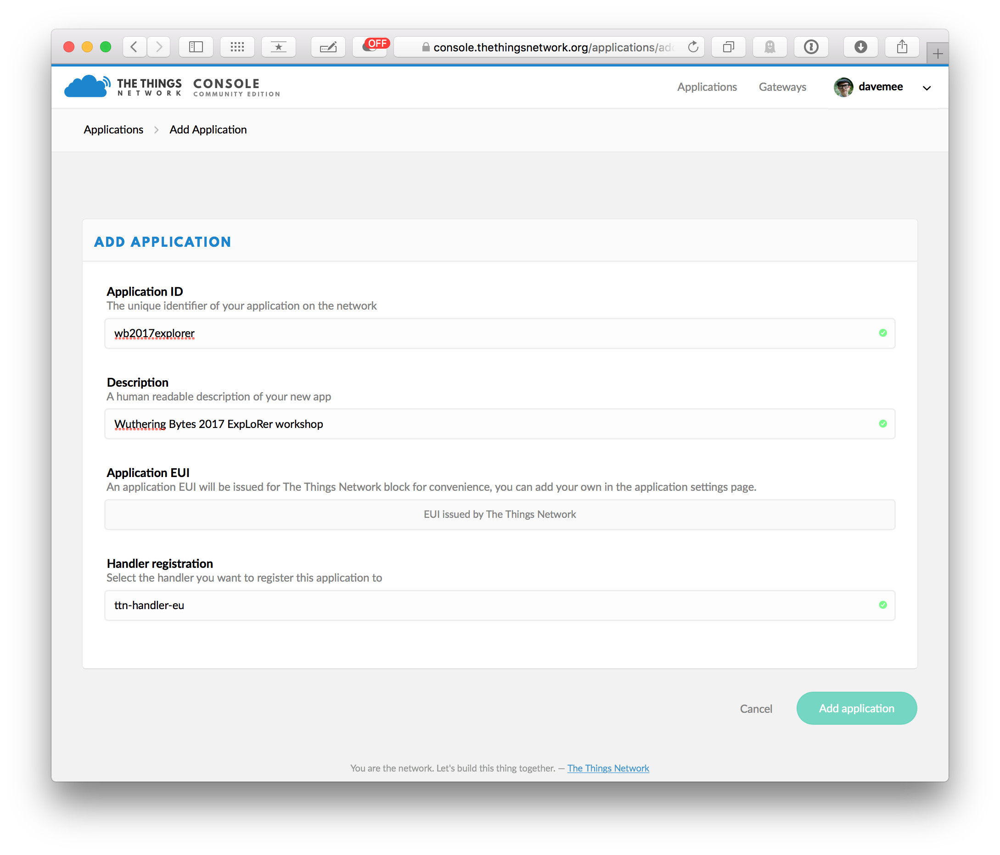
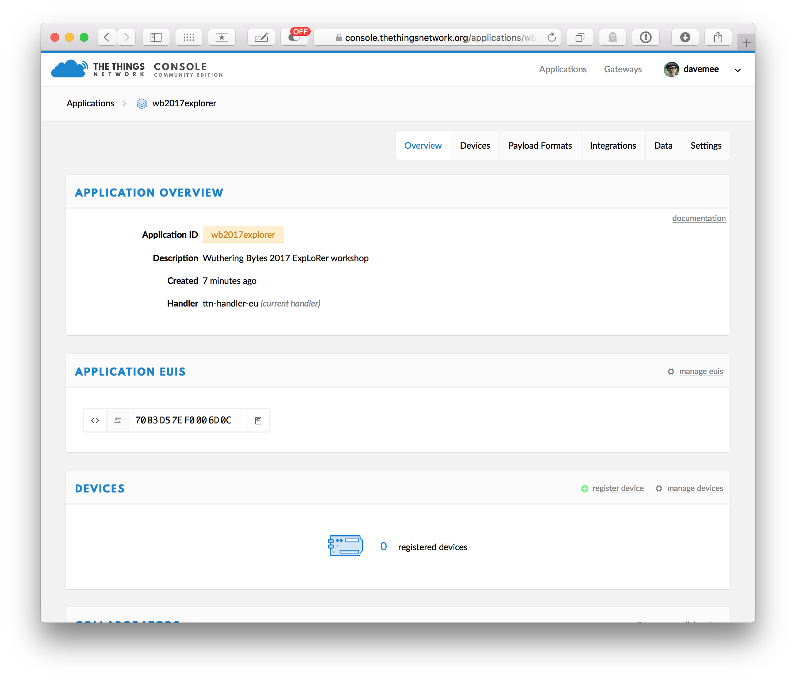
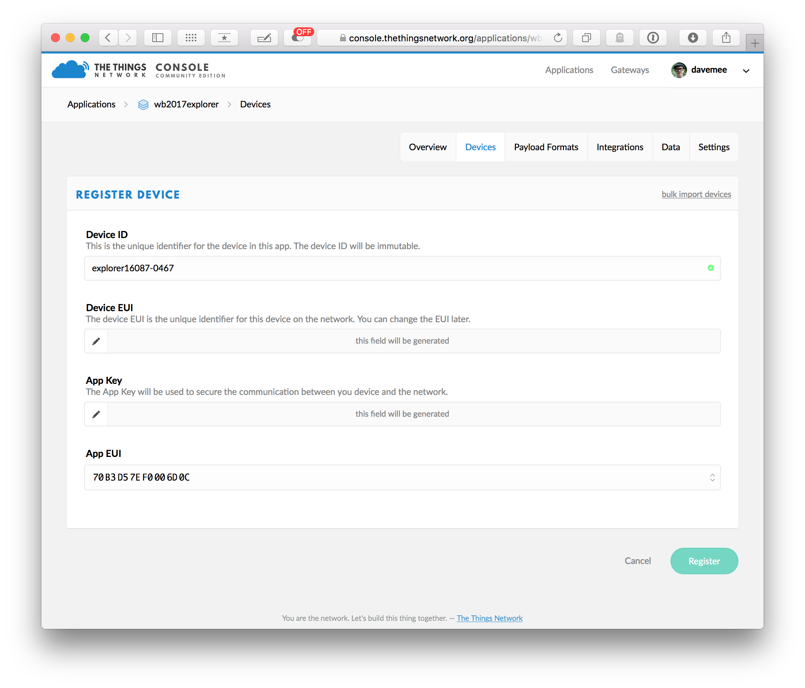
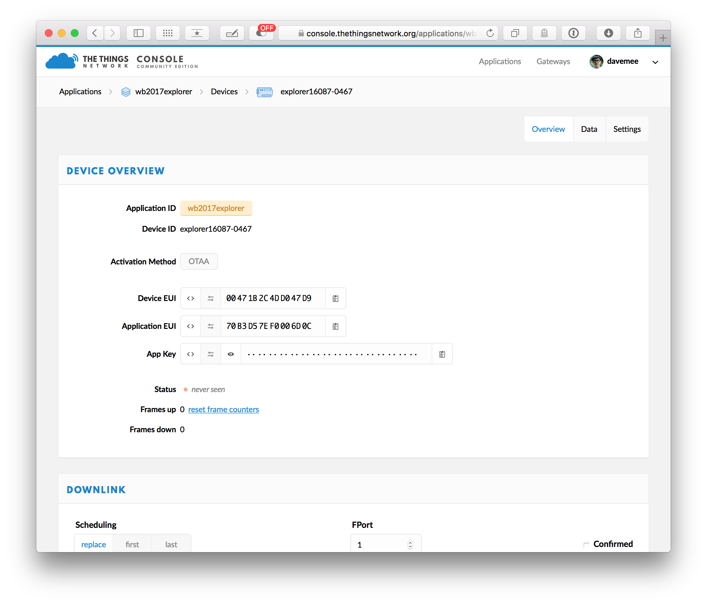
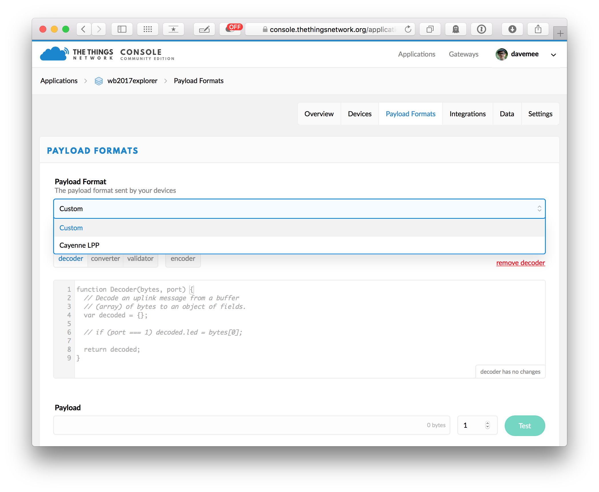
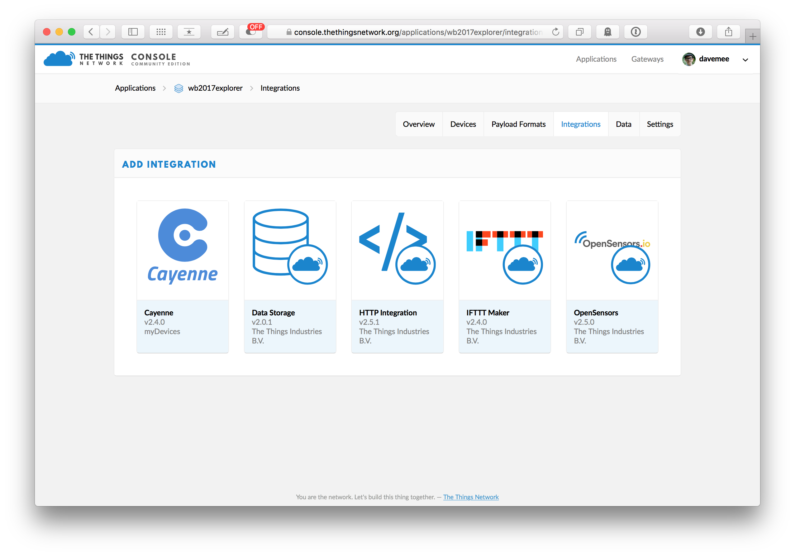
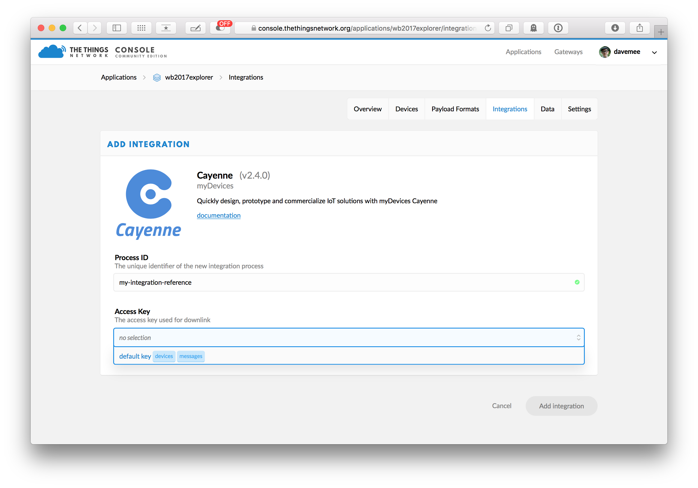
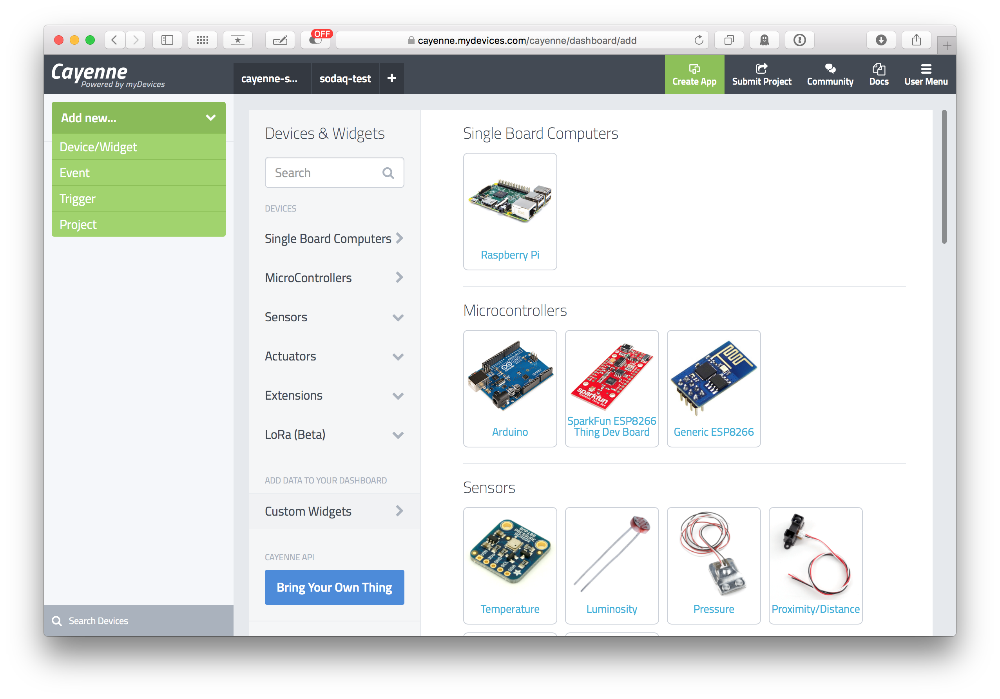
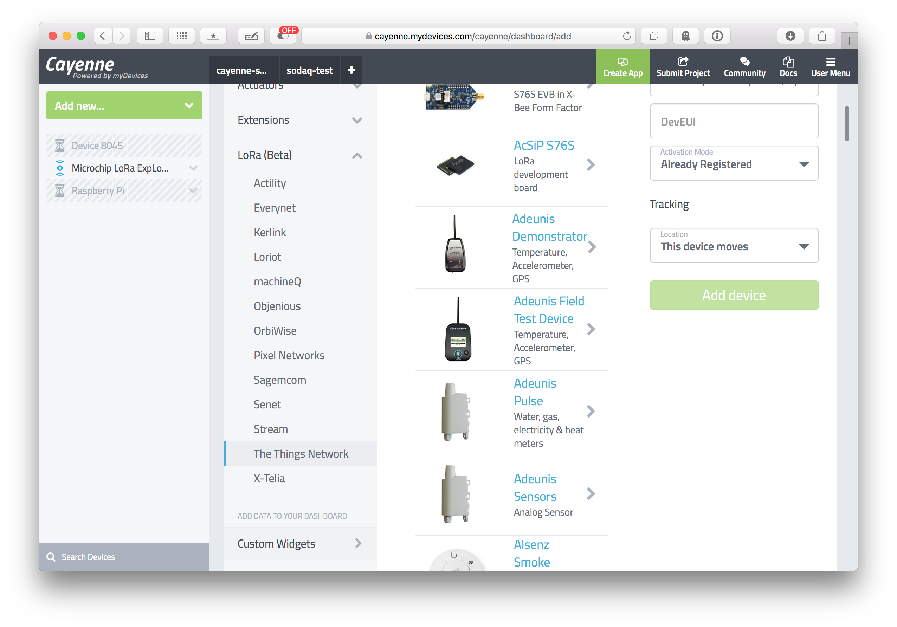
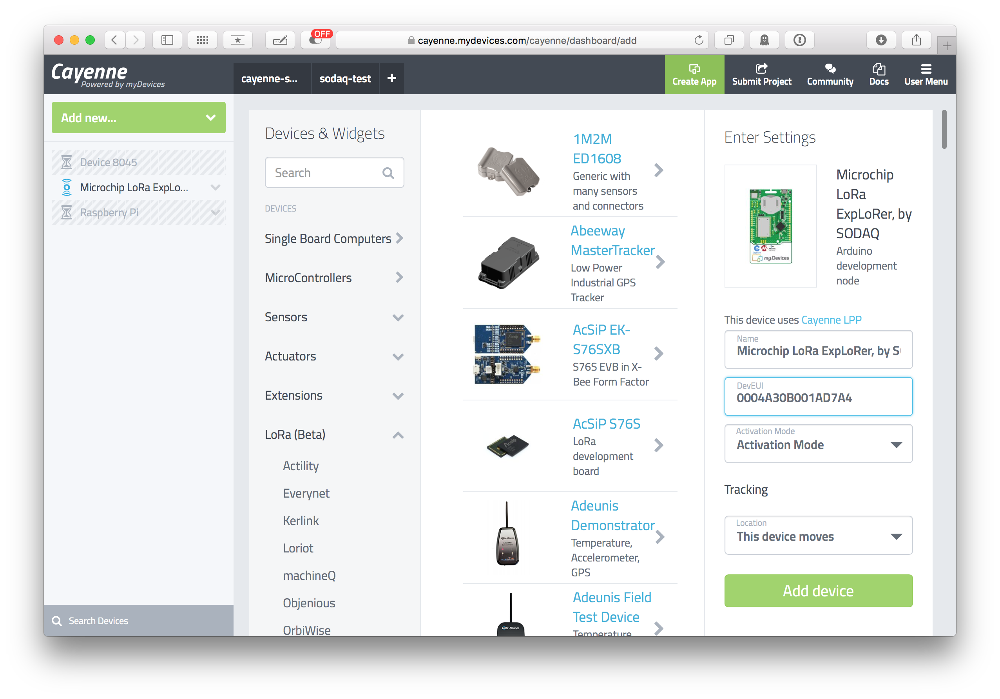

# Setting up integrations with TheThingsNetwork and Cayenne

#### Build and Deploy, Wuthering Bytes, 2017

Make sure you have registered an account at TheThingsNetwork ([account.thethingsnetwork.org/register](https://account.thethingsnetwork.org/register)) and at Cayenne ([cayenne.mydevices.com/cayenne/signup](https://cayenne.mydevices.com/cayenne/signup)) if you plan to use Cayenne integration.

Ensure your ExpLoRer board is running code that either talks to the ThingsNetwork or talks to Cayenne via the ThingsNetwork before debugging problems with your integration!

## Create (or join) an Application for TheThingsNetwork

### Making an application



* Go to [console.thethingsnetwork.org](console.thethingsnetwork.org) 
* 'Add application'
	* **'Application ID'** is an alphanumeric lower-case name for your application
	* **'Description'** is a human-readable version of the application name
	* **'Handler registration'** is where the data ends up - we're going to default to **'ttn-handler-eu'** as the public TTN endpoint
	* Click **'add application'** to create the application and see the overview page for it!

## Adding a device to the application


* View the application page on the console.



* Click 'register device' to add a device.
	* **`Device ID`** is the lowercase alphanumeric name you'll use to find the device. Why not use the serial numbers printed on the sticker as part of the device name?
	* **`Device EUI`** should be from the device itself.
	* **`App EUI`** should be left to be 'generated'.
	* Click **'Register'** to add your device - this will take you to the 'Device Overview' page on the console.

* View the Device Overview page on the console



Use the following details to set up OTAA authentication in your Arduino sketch.

* `Device EUI` (8 bytes)
* `Application EUI` (8 bytes)
* `App Key` (16 bytes)

These details needs a little re-formatting to be usable in an Arduino sketch. The `Device EUI` is formatted as an array of unsigned integers in hex (prefixing each 2 character pair with `0x` to indicate a hexadecimal value) as follows:

```
const uint8_t DevEUI[8] =
{
  0x00,0x04,0xA3,0x0B,
  0x00,0x1A,0xD7,0xA4
};
```

Repeat this for the `AppEUI` and `AppKey` in your Arduino sketch. The OTAA activation will now work and your board will send data to your ThingsNetwork application.

----

## Making an application compatible with Cayenne

* Go to [console.thethingsnetwork.org](console.thethingsnetwork.org) and from there, choose the application    



* Ensure TheThingsNetwork knows you are sending Cayenne LPP encoded data

	* Go to the 'Payload Formats' tab

	* Click `Custom` and change it to `Cayenne LPP`. The other payload function options on the page will disappear as they are no longer needed.

	* Click `save`.



* Integrate your ThingsNetwork application with Cayenne

	* Go to the 'Integrations' tab of your application
	* Click 'add integration'



* Configure your integration

	* Set a unique name for your integration in the `Process ID` field.
	* Choose `default key` in the `Access Key` menu.
	* Click `Add integration` to finish and configuration and start the integration.

## Setting up Cayenne to receive Cayenne LPP payloads from your Microchip SODAQ ExpLoRer



* Go to [cayenne.mydevices.com/cayenne/dashboard/add](https://cayenne.mydevices.com/cayenne/dashboard/add) 
	* Click 'Add new...' to add a new 'Device/Widget' from the menu that opens up.



* Open the 'LoRa (Beta)' menu to choose 'The Things Network' as your carrier



*  Find the 'Microchip LoRa ExpLoRer, by SODAQ' item that appears on the right (don't use the search feature, as this will mysteriously change your carrier selection!) 
	* Set the `DevEUI` field with the Device EUI you used for this device's Arduino sketch and Things Network setup.
	* Set the 'Activation Mode' to 'Already Registered'.
* Click 'Add Device' to save this device to your Cayenne account.

When the first LPP payloads for your device arrive, you'll be able to configure your dashboard with Cayenne.

Cayenne's phone and tablet apps are, in many ways, more feature complete that their website, so it's a good idea to install one of them.


----

# Addendum

## Using the serial passthrough sketch to talk to the RN2483

* Load File→Examples→Sodaq_RN2483→microchip-serial-passthrough    
* Compile and send to the Arduino    
* Open the serial monitor. Commands typed here are sent through the the LoRaWAN module, and results from it are printed in the serial console.    

Useful commands

`sys get ver`:
	Get the version number of the LoRaWAN firmware

`sys get hweui`:
	Get the hardware ID of the device. This is baked-in.

`sys get vdd`:
	Get the battery level in mV from the chip.

`mac get deveui`:
	Get the 8-byte EUI from the board

`mac get devaddr`:
	Get the 4-byte device address.

`mac set devaddr deadbeef`:
	Set the devaddr. This is not saved, until a `mac save` command is issued

`mac save`:
	Store the device parameters

